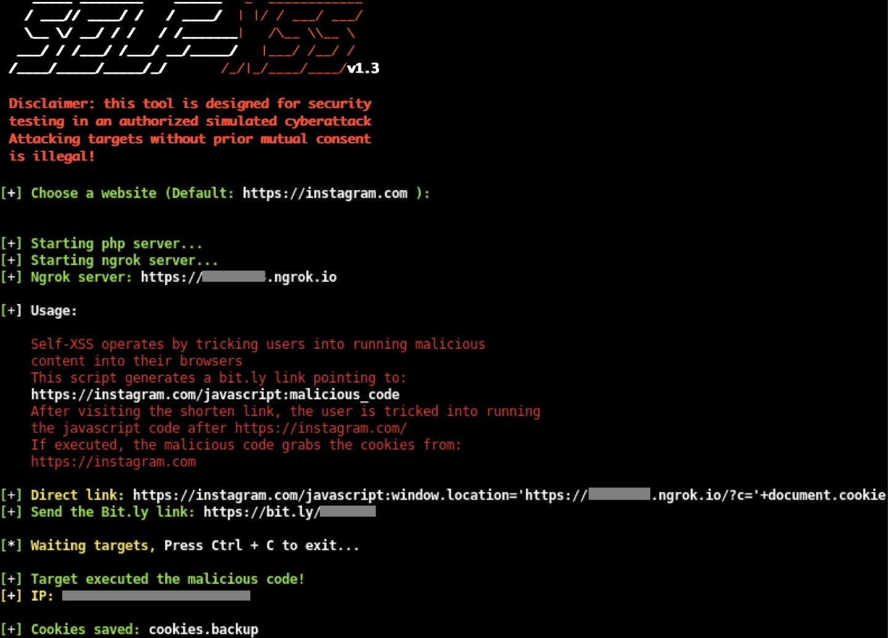
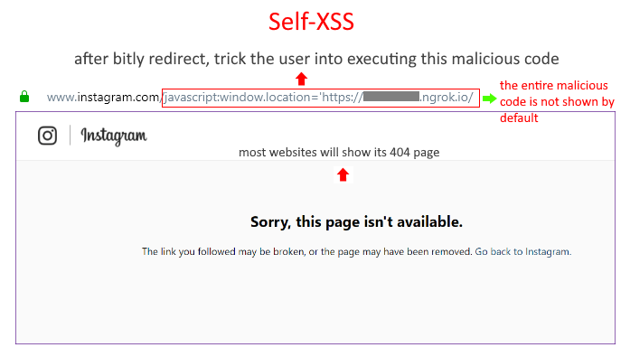

# Self-XSS v1.3
Self-XSS attack using bit.ly to grab cookies tricking users into running malicious code

## Instagram: https://instagram.com/itslilcan



### How it works?

Self-XSS is a social engineering attack used to gain control of victims' web accounts by tricking users into copying and pasting malicious content into their browsers. Since Web browser vendors and web sites have taken steps to mitigate this attack by blocking pasting javascript tag, I figure out a way of doing that using Bit.ly, so we can create a redirect pointing to "website.com/javascript:malicious_code". If the user is tricked to run the javascript code after "website.com/" the cookies of its authenticated/logged session of website.com will be sent to the attacker.



### Features:

Port Forwarding using Ngrok and shortner using Bitly.com (Register for free)

### Requirement

https://bitly.com account (Register for free)

## Legal disclaimer:

Usage of Self-XSS for attacking targets without prior mutual consent is illegal. It's the end user's responsibility to obey all applicable local, state and federal laws. Developers assume no liability and are not responsible for any misuse or damage caused by this program 

### Usage:
```
git clone https://github.com/Came-Dave/selfxss
cd selfxss
bash self-xss.sh
```
